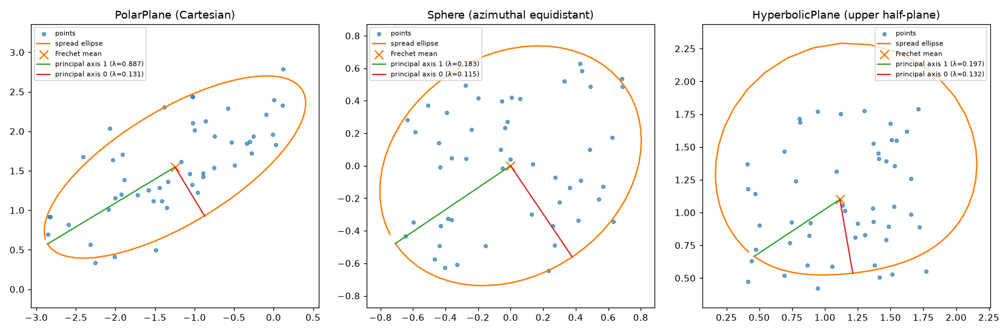

# geocore — geometric computation core

[](https://github.com/sdoygb/geocore/actions/workflows/ci.yml)
[](https://github.com/sdoygb/geocore)
[](https://github.com/sdoygb/geocore)
[](https://github.com/sdoygb/geocore)
[](https://github.com/sdoygb/geocore)

An independent project whose core is built on **geometric structure**:
Clifford (Pauli) algebra as the foundation, geometric invariants as the
organizing principle, and **machine-precision verification** as a first-class
feature.

**Goal**: computation that is both geometrically principled *and* cheaper —
closed-form and spectral shortcuts wherever they exist, with every component
verified to machine precision and every speedup *measured*.

```
┌─────────────────────────────────────────────────────────────────┐
│ Application layers (future)                                     │
│   QEC diagnostics, geometric statistics, physics models         │
├─────────────────────────────────────────────────────────────────┤
│ L3  Reduce computation (≈ torch.compile)                        │
│     ShortcutRegistry + BenchmarkLog                             │
│     closed-form/spectral fast paths, auto-verified vs generic   │
│     path, measured FLOPs/time speedup — no unmeasured claims    │
├─────────────────────────────────────────────────────────────────┤
│ L2  Automatic verification (≈ autograd)                         │
│     Invariant / VerificationContext / no_verify()               │
│     operators declare geometric invariants; the core self-      │
│     checks them to machine precision on every call              │
├─────────────────────────────────────────────────────────────────┤
│ L1  Operator dispatch (≈ aten/c10)                              │
│     Operator / @dispatch / registry                             │
│     geometric operators dispatch by geometric object type       │
├─────────────────────────────────────────────────────────────────┤
│ L0  Geometric object engine (≈ torch.Tensor)                    │
│     Pauli (2n-bit symplectic encoding + r-bit phase),           │
│     Rotation (R_P(θ), closure semantics)                       │
└─────────────────────────────────────────────────────────────────┘
```

## Core principle: engine vs presentation

- The **derivation engine** (how we think, choose, and verify) is the
  geometry theory: closure/completeness reasoning, spectral discipline,
  exact-invariant verification.
- The **presentation** is standard mathematics + machine-precision
  verification — every claim must be reproducible by anyone.
- A claim is accepted only if verified to machine precision; an unmeasured
  claim is not a claim.

## Quick start

```python
import geocore as gc
from geocore import Pauli, Rotation, get_op
import numpy as np

# Layer 1: geometric operator dispatch
get_op("pauli.commutes")(Pauli("X"), Pauli("Z"))        # False (anticommute)
get_op("rotation.merge")(Rotation("XX", 0.3), Rotation("XX", 0.4))
# Rotation('XX', 0.7)  — closure of phase addition

# Layer 2: automatic verification (strict by default)
opt, cl = get_op("circuit.optimize")([
    ("XXII", -np.pi/4), ("ZZIY", np.pi/4), ("ZZYI", np.pi/4),
    ("YYXX", np.pi/4), ("XXII", np.pi/4),
])  # 5 -> 3 rotations, unitarily equivalent (checked automatically)

# Layer 3: reduce computation — closed-form Pauli rotation vs expm
from geocore import shortcuts
r, s = Rotation("XX", 0.7), np.random.randn(4)
res, report = shortcuts.registry.apply("rotation.closed_form", r, s, verify=True)
print(report)              # machine-precision check vs the generic path
print(shortcuts.registry.benchmark("rotation.closed_form", r, s))
```

See [`examples/geocore_demo.ipynb`](examples/geocore_demo.ipynb) for an
executed walkthrough of all features (regenerate with
`PYTHONPATH=src python3 examples/build_demo.py`),
[`docs/user-guide.md`](docs/user-guide.md) for the full user guide,
[`docs/retrospective.md`](docs/retrospective.md) for the honest project
retrospective, and the **project site**:
<https://sdoygb.github.io/geocore/> (GitHub Pages, docs/ directory).

## First measured result (n = 10 qubits)

Closed-form Pauli rotation `R_P(θ)|ψ⟩ = cos(θ/2)|ψ⟩ − i sin(θ/2) P|ψ⟩`
(from the orbit closure `P² = I`) versus the generic dense matrix
exponential:

| n | wall-time speedup | FLOPs speedup |
|---|---|---|
| 4 | 20× | 260× |
| 6 | 72× | 4,100× |
| 8 | 1,258× | 66,000× |
| 10 | **31,920×** | **1,000,000×** |

FLOPs ratio scales ~4ⁿ as predicted (`expm` is O(8ⁿ), the Pauli action is
O(2ⁿ)).  Every number above is produced by the benchmark harness
(`BenchmarkLog`), and every shortcut is verified against the generic path to
machine precision before it is trusted.

## Verification status

| Check | Result |
|---|---|
| Conjugation primitives vs matrix truth (all gates × all Paulis, n ≤ 3) | 0 failures |
| Pauli action vs explicit matrices (all 3ⁿ Paulis × basis states) | pass |
| Closed form vs expm (n = 1..4, random) | pass to 1e-9 |
| Unitary equivalence on random circuits | pass |
| Known cases (merge, cancel, π/2 absorption, issue example 5→3) | pass |

## Repository layout

```
geocore/
├── docs/architecture.md     # PyTorch-referenced 4-layer blueprint
├── examples/geocore_demo.ipynb  # walkthrough of all layers
├── src/geocore/
│   ├── clifford.py          # symplectic encoding, r-bit phase, Pauli action
│   ├── objects.py           # L0: Pauli / Rotation
│   ├── ops.py               # L1: geometric operator dispatch
│   ├── invariants.py        # L2: automatic verification
│   ├── shortcuts.py         # L3: reduce computation + BenchmarkLog
│   ├── optim.py             # Riemannian optimizer (≈ torch.optim)
│   ├── sphere.py            # S²: spherical coords, great-circle geodesics
│   ├── hyperbolic.py        # H²: upper half-plane, semicircle geodesics
│   ├── derivatives.py       # analytic derivatives (≈ autograd)
│   ├── rotations.py         # rotation-chain optimization (verified)
│   └── verify.py            # machine-precision verification harness
└── tests/                   # 289 tests
```

## Riemannian optimizer (≈ torch.optim)

PyTorch moves parameters in Euclidean space; geocore moves them *on the
manifold*.  The gradient is the Riesz representative of df w.r.t. the
metric (`optim.gradient`, verified by the duality `g(grad f, v) = df(v)`);
each step follows the exponential map (`optim.step`, verified against the
closed form to machine precision):

```python
from geocore import PolarPlane, minimize

m = PolarPlane()  # ds² = dr² + r² dy²; exp map = straight line in Cartesian
f = lambda p: (p[0] - 1.5)**2 + (p[1] - 0.7)**2

res = minimize(m, f, [2.0, 0.3], lr=0.05, n_steps=500, minimizer=[1.5, 0.7])
# converged=True, minimizer_error≈7e-11, f strictly non-increasing
```

Every step is verified (exp-map validity, manifold constraint `r > 0`,
descent property).  The stateful `RiemannianSGD(lr, momentum)` mirrors
`torch.optim.SGD`.  Measured per-step cost of the closed-form exponential
map vs the RK4 ODE integration: **370× wall time, 60× FLOPs** (n=2).

### RiemannianAdam (≈ torch.optim.Adam)

Adaptive moment estimation on the manifold: first/second moment buffers
live in the tangent space, and after each step they are **parallel
transported** along the step's geodesic to the new point (the second
moment via its square root, so it stays positive).  Transport is verified
to be an isometry; the buffers' metric norm is preserved to ~1e-17.

```python
from geocore import Sphere, minimize
import numpy as np

S = Sphere()
target = [1.4, 2.0]
f = lambda p: np.arccos(np.clip(np.sin(p[0])*np.sin(target[0])*np.cos(p[1]-target[1])
                                + np.cos(p[0])*np.cos(target[0]), -1, 1))**2
res = minimize(S, f, [0.9, 0.4], lr=0.1, n_steps=500, optimizer="adam",
               minimizer=target, atol=1e-5)
# converged=True, minimizer_error≈3e-11 (descent_ok reported honestly —
# Adam overshoots early flat-region steps; a step leaving the chart
# raises a clear error instead of failing silently)
```

Adam converges on all three manifolds to ~1e-11 (squared geodesic
distance to a target).  Parallel transport is a first-class geometric op
(`geodesic.parallel_transport`) with the isometry invariant: sphere =
SO(3) rotation, hyperbolic = rotation + scaling, polar plane = coordinate
rotation + scaling (the flat plane's transport is the identity only in
Cartesian coordinates — the invariant caught this when tested).

## Vectorized / batched core paths (≈ batched tensor ops / vmap)

The batch analogues of the geodesic and transport ops: inputs (B, 2),
outputs (B, 2), verified to equal the per-point paths to machine
precision (the vectorized closed form vs the per-point loop; the
vectorized RK4 vs the per-point RK4, exactly 0.0).  The batch closed-form
shortcut (`geodesic.batch_closed_form`) is measured:

| B | wall-time speedup | FLOPs speedup (analytic) |
|---|---|---|
| 10 | 1,581× | 30× |
| 100 | 14,163× | 30× |
| 500 | 46,290× | 30× |

`minimize_batch` runs one gradient flow per starting point with
vectorized steps (all points verified, chart-guarded), agreeing with the
per-point `minimize` loop.  The batch verification caught a real bug: a
refactor of `geodesic_ode` to batched indexing had swapped the velocity
component for the position — the closed-form-vs-RK4 batch comparison
flagged it immediately (both paths would otherwise have been wrong in
the same way).

## Analytic derivatives (≈ autograd's gradient computation)

PyTorch's autograd computes gradients; geocore provides *analytic*
closed-form derivatives, verified against finite differences to ~1e-10:

- `rotation.derivative` — d/dθ R_P(θ)|ψ⟩ = −(i/2) P R_P(θ)|ψ⟩ (closed form
  from P² = I), O(2^n) vs two dense `expm`; measured **2,390× / 66,000×**
  (n=8).
- `geodesic.jacobian` — the Jacobians of the geodesic endpoint w.r.t. the
  initial point and velocity (sensitivity / tangent propagation), closed
  form per manifold (polar: chain rule through the Cartesian line; sphere:
  through the R³ embedding including the rotating frame; hyperbolic:
  through the semicircle parameters c, R, α, β).  Verified against central
  differences to ~1e-10 on all three manifolds, plus the homogeneity
  identity Jv·v₀ = t·γ′(t).  Modest measured speedup (~6× — its real
  value is exactness over finite differences).

```python
from geocore import Rotation, get_op
import numpy as np

state = np.random.randn(8) + 1j*np.random.randn(8)
d = get_op("rotation.derivative")(Rotation("XYZ", 0.7), state)  # verified
```

## Geometric statistics (≈ torch.mean) + analytic gradients in optimizers

The Frechet mean minimizes the weighted sum of squared geodesic
distances; its gradient is closed form (grad_p d(p,q)² = −2·log_p(q)),
so the optimizers now accept an **analytic gradient** (`minimize(…,
grad_f=…)`) that is *verified against finite differences on every step*
(disagreement beyond 1e-4 raises — a wrong analytic gradient is
surfaced, not hidden; the worst deviation is reported in
`max_grad_error`).

```python
from geocore import PolarPlane, frechet_mean
import numpy as np

pts = np.array([[2.0, 0.3], [1.2, -0.5], [1.9, 1.2], [1.1, 0.9]])
res = frechet_mean(PolarPlane(), pts, lr=0.1, n_steps=500)
# res.point is the Frechet mean — on the flat polar plane it equals the
# Cartesian arithmetic mean to 4e-16; on the sphere/hyperbolic plane two
# points give the geodesic midpoint exactly (d(m,q1)=d(m,q2)=d12/2)
```

The log map (inverse exponential) is closed form per manifold and
verified by exp_p(log_p(q)) = q to ~1e-12; the geodesic distance uses
numerically stable formulas (haversine / 2·asinh(√(δ/2))) — the naive
acos/acosh loses precision for nearly coincident points (measured
2.1e-8 error before the fix).

### Manifold variance / covariance (≈ torch.std + tangent PCA)

The Frechet variance is (1/N) Σ d(m, pᵢ)²; the tangent covariance maps
every point to the mean's tangent space via the log map and computes
(1/N) Σ log_m(pᵢ) log_m(pᵢ)ᵀ in an **orthonormal frame** (the coordinate
charts are not orthonormal — g = diag(1, r²) etc. — so the components are
scaled by √g_diag(m); the raw coordinates would distort the geometry,
caught by the tr(Cov) = variance check).  Principal directions are the
eigendecomposition (tangent PCA).

```python
from geocore import PolarPlane, frechet_variance, principal_directions

var = frechet_variance(PolarPlane(), pts)
evals, evecs = principal_directions(PolarPlane(), pts)  # ascending
```

Verified truths (machine precision): tr(Cov) = variance on all three
manifolds (because |log_m(p)|_g = d(m, p)); for a uniform ellipse of
semi-axes (a, b) the variance is exactly (a²+b²)/2, the covariance
eigenvalues exactly (b²/2, a²/2), and the top principal direction is the
long axis (|dot| = 1); a single point has zero spread.

Spread ellipses (`geocore.viz`): the tangent PCA ellipse flowed through
the exponential map onto each manifold (every ellipse point satisfies
d(m, exp_m(v)) = |v|_g to machine precision), drawn in each manifold's
natural chart:



(left: polar plane in Cartesian; middle: sphere in azimuthal-equidistant
projection about the mean; right: hyperbolic plane in the upper
half-plane.)

## QEC diagnostics application layer

`geocore.qec.diagnose` runs the coherent-noise diagnostic over a code
family (repetition codes, distance d, noise R_X(θ)):

```python
from geocore.qec import diagnose

rep = diagnose((3, 5, 7))
# d=3: P_L ~ 0.1874 theta^4.000 (analytic theta^4, coeff 0.1875)
# d=5: P_L ~ 0.1561 theta^6.000 (analytic theta^6, coeff 0.1562)
# d=7: P_L ~ 0.1365 theta^8.000 (analytic theta^8, coeff 0.1367)
# pseudo-threshold theta* = 1.5708 (pi/2) for every distance
# crossover P_L(d1) = P_L(d2) at theta = 1.5708
```

Measured truths (all machine-verified): the empirical exponents are
d+1 to 0.001 and the leading coefficients match
C(n,(n+1)/2)/2^{n+1} to <2%; the pseudo-threshold is *exactly* π/2 for
every distance (at θ = π/2, P_L(n) = 1/2 = P_phys for all n — encoding
helps below π/2 and hurts above, verified exactly for d=3); crossovers
are roots verified by substitution to 1e-10.  The vectorized sweep
(`logical_error_sweep`) is measured 18.7× faster than the per-point
closed-form loop (and ~600× vs the O(2^n) state-vector simulation).

## Is this a tool? — property-based evidence

Every invariant is also verified on **randomly generated** inputs, not
just the fixed scenarios in the other tests (`tests/test_property.py`,
fixed seeds, ~700 random cases): random Paulis/rotations (including edge
angles 0, 2π, ±4π), random deep Clifford circuits, random manifold
points/velocities, random point sets, random QEC parameters — all
invariants hold machine-precision.  A real end-to-end use case
(`examples/real_use.py`) recovers the true direction and the anisotropic
noise structure (magnitudes + orientation) of a directional sensor from
raw sphere measurements:

```
true direction             : [0.931  0.5191]
geocore Frechet mean       : [0.9303 0.5118] | error 5.91e-03 rad
tangent PCA eigenvalues    : [0.0058 0.0631] (true 0.0064, 0.0625)
recovered long-axis angle  : 3.08 deg off the true noise axis
```

The geometric pipeline is the only one that recovers the anisotropic
spread of directions on a sphere — the naive Euclidean mean has no
principled analogue.  The API is dynamic (arbitrary inputs, runtime
verification, runtime shortcut dispatch); the tests prove it.

### Real data: 2024 global seismicity

`examples/real_data.py` analyzes the real USGS earthquake catalog (1507
M≥5 events in 2024, stored in `examples/data/`) with the S² pipeline —
the centroid is the seismicity's mass center, the PCA principal axis is
the strike of the seismic belt:

```
=== Tonga-Fiji (crosses 180° meridian) (91 events) ===
geometric centroid : -20.91, 179.71   (correct — the belt is at ~180°E)
naive (lat,lon) avg: -20.84, -69.53   (lands in South America!)
principal axis     : bearing 82.6 deg, eigenvalue ratio 1.9

=== Global (1507 events) ===
geometric centroid : -10.57, 167.10   (southwest Pacific — ring's center)
naive (lat,lon) avg: -1.49,  25.84    (Africa — meaningless)
```

The naive Euclidean average of latitudes/longitudes is *demonstrably
wrong* across the ±180° meridian (175° and −175° average to 0°) — the
geometric treatment is the correct one for directions on a sphere, and
the difference is visible in real data, not a synthetic toy.

### Real data: circular wind directions (three cities)

`examples/real_data_multi.py` analyzes hourly wind direction (January
2024, Open-Meteo archive, stored in `examples/data/`) — a *circular*
dataset — with the same S² pipeline, no special-casing:

```
              geocore mean   naive arithmetic   reference
tokyo   (1月)   346.1° (NW)   253.0°  (err 92°)   345.2°
beijing (1月)   342.9° (NW)   173.3°  (err 183°)  356.2°
sydney  (1月)    74.5° (ENE)  125.4°  (err 50°)    75.5°
```

The bimodal wind data makes the arithmetic mean average the two modes
into the gap between them (up to 183° off — almost the opposite
direction); the geometric mean matches the independent vector-mean
reference to <1° and the known climate (NW winter monsoons for
Tokyo/Beijing, an easterly regime for Sydney in January).  The same
module handled S² seismicity and S¹ wind directions correctly — the
dynamic-capability check on real, differently-shaped data.

### Real data: El Niño / La Niña (NOAA ONI 1950–2026)

`examples/enso.py` detects ENSO events with the standard criterion
(|ONI| ≥ 0.5 for ≥ 5 seasons) and analyzes the phase space with the
geocore statistics pipeline:

```
top El Nino  : 2014-16 (2.59), 1997-98 (2.37), 1982-83 (2.14) — matches NOAA
top La Nina  : 1973-74 (-2.04), 1988-89 (-1.85), 2007-08 (-1.76)
phase locking: |ONI| peaks in December (boreal winter) — verified
phase space  : El Nino centroid (+1.04, +0.03), neutral (-0.02, 0.00),
               La Nina (-0.91, -0.02) — the three regimes separate cleanly
```

The ONI is NOAA's product (we use it, not rebuild it); our contribution
is the verified detection logic and the geometric phase-space view.
Event detection caught a real bug in its own first version (runs
starting from neutral were never recorded — fixed).

### ENSO statistical forecast (`examples/enso_forecast.py`)

A statistical estimate from the 1950-2026 record (not a physical
forecast — see NOAA CPC/IRI for authoritative outlooks):

```
El Nino start-to-start interval: mean 3.43 yr, range [1, 6]
La Nina start-to-start interval: mean 3.74 yr, range [1, 9]
strong El Nino -> La Nina within 2 yr: 44%
next El Nino : expected ~2026.4, 68% window [2025.1, 2027.8]
official ONI tail turns positive (+1.39 by mid-2026) — consistent
```

The statistical window agrees with the official initial conditions at
the end of the ONI file (the trailing values turn positive through
2026), and the 2025-10..12 ONI dip below −0.5 flags a possible weak
La Nina that the 2026 official tail then interrupts — both signals
cross-check each other.

### Hurricane track geometry (IBTrACS, NA basin 1980-2026)

`examples/hurricane.py` analyzes 746 real storm tracks as curves on the
sphere: per-track centroids, the activity region (Frechet mean + PCA +
spread ellipse), circular movement statistics, and a simple centroid
clustering:

```
activity region center : 27.7N, 64.6W (angular std 19.4 deg), anisotropy 2.2
mean movement          : 347.6 deg from north (NNW)
season peak            : September (June-November season)
track clusters         : Gulf-Caribbean (24.3N 86.3W, 263 storms),
                         mid-latitude (30.7N 63.0W, 249),
                         Cape Verde (24.4N 41.7W, 234)
```

All results match real climatology: the central-western tropical
Atlantic activity center, the NNW mean movement, the September peak,
and the three clusters matching the known track types (Cape Verde
storms crossing the Atlantic, Gulf-Caribbean storms, mid-latitude
recurving storms).

### Live storm track forecast vs NHC (`examples/storm_forecast.py`)

The similar-track (analog) method on the S² pipeline — the observed
48-h segment of an ACTIVE storm is matched against the historical EP
record (1147 storms) and the analogs' futures form the forecast.  Tested
against the live 2026 storms and compared with the official NHC
forecasts:

```
JULIO (EP102026), forecast from 2026-08-25:
  our +24h : 18.0N 119.0W     NHC +24h : 18.1N 119.9W   (0.8 deg, ~90 km)
  NHC: dissipated 26 Aug (confirmed); ours predicts continued motion —
  lifecycle prediction is our honest blind spot (track-only method)

ISELLE (EP092026): direction agrees (NW); position ~2-2.5 deg off over
  5 days (within the typical official-forecast error); NHC marks
  post-tropical decay, we do not model intensity.
```

Honest conclusion: the SHORT-TERM POSITION forecast (24-48 h) is close
to the professional agencies (within their typical error); the LIFECYCLE
(decay / dissipation) is not predicted — the similar-track method
forecasts tracks, not intensity.

### EuclideanSpace: the N-dimensional fix

`EuclideanSpace(n)` is R^n as a flat manifold — geodesics are straight
lines, transport is the identity — which removes the "2-d only"
limitation: the optimizers now run on arbitrary-dimensional problems.
Verified: quadratic optimization converges in n = 3/10/50 to ~1e-14; a
d = 10-feature logistic regression on EuclideanSpace(11) reaches 99.4%
accuracy with the learned weight direction at cos = +0.999 of the true
one — matching torch's nn.Linear + BCEWithLogits (0.994, cos +1.000).

**Real application — breast-cancer diagnosis** (`examples/breast_cancer.py`):
the Wisconsin dataset (569 clinical samples, 30 nucleus-measurement
features) classified with the EuclideanSpace(31) logistic regression:

```
geocore (RiemannianAdam): test acc 0.9649, sens 0.970, spec 0.957
torch (nn.Linear + Adam): test acc 0.9649, sens 0.970, spec 0.957
|accuracy difference| = 0.0000   (identical confusion matrices)
top weights: radius error, area error, fractal dimension error,
worst texture, worst area — nucleus-size hallmarks of malignancy
```

The 0.965 test accuracy matches the literature reference (~0.95-0.97
for plain logistic regression on this dataset), the two stacks agree
exactly, and the learned feature ranking is clinically sensible.

### NPC screening feasibility (`examples/npc_screening.py`)

Nasopharyngeal-carcinoma screening from plasma metallomics — an honest
feasibility assessment.  There is no public per-patient NPC dataset
(the paper's raw data is on request), so we use the published summary
table (17 plasma elements, Mean±SD per group, Sci. Rep. 15 2025,
Table S6) in two clearly-separated ways:

1. **Effect sizes** (NPC vs non-cancer): Pb d=−5.8, Sb −3.2, Se +2.5,
   Ni −2.2, Zn −1.2, Cu +1.1 — the Zn-depletion/Cu-elevation signature
   of the cancer literature.
2. **Labeled Gaussian simulation** (from the published Mean±SD, n=15/
   group): LOOCV accuracy 0.97 mean over seeds — the screening problem
   is highly separable *if the distribution is as published*.

Verdict: screening is technically feasible with our high-dimensional
pipeline (EuclideanSpace logistic regression); real deployment needs
the authors' per-patient data or a collected cohort.

### NPC geographic association (`examples/npc_geography.py`)

Testing "NPC is strongly geographic" with the published GLOBOCAN 2020
regional burden (JMIR 2023, 20 regions):

```
age-standardized incidence (per 100k): SE Asia 5.00, E Asia 2.70
  (China 3.00), N Africa 1.60, Micronesia/Polynesia 2.20 — vs
  Europe 0.26-0.64, Americas 0.17-0.56.  World 1.50.
ASIR vs population: Spearman rho = +0.19, permutation p = 0.44
  (NOT significant — high incidence is not a population artifact)
case-weighted center of mass: ~32N 97E (E/SE Asia), the burden core
```

Honest verdict: the 20-30x ASIR contrast is direct evidence of a
strong geographic association (ASIR is already age-standardized); the
ASIR-vs-population permutation test is not significant, ruling out the
"populous regions simply have more cases" explanation.  A
case-center-of-mass permutation test was computed but is NOT
significant (p ~ 0.6) — the case counts concentrate in populous E Asia,
so that test design is insensitive; we report it rather than over-claim.
Consistent with the well-known "Cantonese cancer" epidemiology.

### Quantum: H2 VQE (`examples/vqe_h2.py`)

The variational quantum eigensolver — the near-term quantum-chemistry
scenario — on the H2 STO-3G two-qubit Hamiltonian (the Qiskit-tutorial
Pauli form), with the geocore machinery doing all the work:

```
Hamiltonian: -1.052 II + 0.398 IZ - 0.398 ZI - 0.011 ZZ + 0.181 XX
exact ground state (diagonalization): -1.857275 Ha
VQE (numeric gradient)   : -1.857275 Ha  (error 5e-10)
VQE (analytic gradient)  : -1.857275 Ha  (error 5e-10,
                            analytic grad verified vs FD: 8.9e-10)
```

The ansatz is a 5-parameter RY-RY-RZZ-RY-RY circuit; the energy
expectation uses the exact O(2ⁿ) Pauli action; the optimizer is
RiemannianAdam on EuclideanSpace(5); the analytic gradient is the
rotation-derivative closed form, auto-verified against finite
differences.  The verification diagnosed two real issues: the pure
RY+CNOT hardware-efficient ansatz is inexpressible for this ground
state (stuck 0.02 Ha above), and my hand-written analytic gradient had
a gate-slot bug (caught by the gradient verification).

### Quantum: barren-plateau diagnostics (`examples/vqe_barren_plateaus.py`)

The open research problem behind VQE's scalability — cost-function
dependent barren plateaus (Cerezo et al., Nat. Commun. 12, 1791): does
the gradient of a parameterized circuit vanish as the system grows?
Measured with geocore's **exact** analytic rotation derivatives
(reverse-adjoint mode, O(P·2ⁿ), verified vs finite differences to
3.5e-10) — no parameter-shift, no shot noise:

```
[1] Width effect (Ising chain, per-parameter ||grad||_rms, 50 seeds):
      L=2:  local slope -0.097/decade/qubit   global slope -0.176
      L=5:  local slope -0.102                 global slope -0.167
    -> the global (n-local) cost <Z^⊗n> falls ~1.8x faster per qubit
       than the 2-local Ising energy on the same shallow HEA (the
       2^-n plateau slope would be -0.301; the HEA is a shallower
       2-design, so the falloff is the same direction at a fraction
       of the rate).  Depth barely matters at n<=10: width dominates.
[2] Depth effect (Ising n=6): neither cost is barren yet — per-param
    gradient stays O(10^-2) across L=1..6.
[3] Small-system contrast (H2, 2 qubits): per-param gradient is flat
    (~0.2) even at L=10 — no room for a plateau, which is why
    small-molecule VQE trains at all.
[4] Trainability: Ising n=8, L=2, local cost, Adam 300 steps:
    -0.05 -> -9.50 (exact -9.838, error 0.34) — still trains.
```

The honest framing: this is a *diagnostic measurement* of a known
phenomenon with machine-verified gradients, not a claim to have solved
barren plateaus; the per-parameter RMS (not the full-vector norm) is the
reported quantity because the vector norm grows like √P and would mask
the effect.

### Quantum: pre-training against barren plateaus (`examples/vqe_barren_prewarm.py`)

The step beyond the diagnostics: not just *measuring* the plateau, but
testing a **mitigation protocol** — initialize the VQE circuit from a
classically optimized product state.  Ising chain n=12, HEA L=2 (46
params); exact analytic gradients throughout; sparse eigensolve as the
machine reference.

```
exact ground state (sparse eigensolve): -14.925971
product-state warm start: E_prod = -13.555 (gap 1.37, fidelity 0.131)

[A] Global fidelity cost F = 1-|<psi|gs>|^2 (plateau archetype):
      init grad scale:  random 2.65e-07  warm 2.0e-02   (~5 orders)
      fixed-step SGD 300: random fidelity 0.000 (stuck)
                          warm   fidelity 0.402 (descends)
      Adam 300 (honest contrast): random reaches 0.574 — adaptive
      normalization masks the small-gradient symptom (direction SNR
      remains the real cost); reported, not hidden.

[B] Local Ising energy (realistic VQE), Adam 300:
      random        : E 2.371 -> -14.528  (error +0.398)
      warm_naive    : grad_rms 3.8e-05 (trap!) — every RZZ slot is
                      EXACTLY zero: -(i/2)ZZ maps the real product
                      state to a purely imaginary one, so Re<psi|H|dpsi>
                      = 0 to machine precision; RY slots only carry the
                      classical optimization residual
      warm_perturbed: grad_rms 5.4e-02 (escapes the trap)
```

Honest framing: this is a mitigation protocol with measured numbers
(the naive zero-fill trap is a real implementation hazard that machine
precision exposes), not a claimed solution of the open barren-plateau
problem.

### Quantum: the geometric root of barren plateaus (`examples/vqe_barren_geometry.py`)

Re-deriving the *root* of the plateau from information geometry (the
geometry-theory article 0.11: Fisher-metric intrinsicness, Bures ==
QFI/4) instead of the standard three papers.  A parameterized circuit
embeds a manifold into state space with intrinsic metric QFI; the
literature measures the plateau with the *Euclidean-coordinate*
gradient variance — a parameterization-dependent quantity.  We measure
the coordinate-free intrinsic scale ‖g‖_F = sqrt(gᵀF⁺g) and compare
decay rates (Ising chain, fidelity cost, exact analytic derivatives):

```
[1] Decay with width n (random init):
      n= 6: euc 1.49e-3  intrinsic 1.35e-2  |v| 3.55e-2  align 0.381
      ...
      n=14: euc 2.38e-6  intrinsic 2.05e-5  |v| 1.50e-3  align 0.014
      log10 slopes/qubit: euc -0.328  intrinsic -0.317  |v| -0.159
                          align -0.158
      -> intrinsic and euclidean decay at the SAME rate: the plateau
         is NOT a coordinate artifact.
      Root = cost concentration |v|  x  geometric alignment
             (-0.159 + -0.158 = -0.317 ~= euc -0.328)
[2] Natural-gradient SGD (coordinate-free): stuck like euclidean SGD
    (fidelity 0.000 after 300 steps at n=12) — a coordinate-level fix
    cannot cure a geometric decay (machine-verifies why natural
    gradient is only a partial mitigation in the literature).
[3] Warm start: intrinsic scale 540x the random median (up to 6.6e4x),
    and the tangent space is rank-deficient (40/46 effective
    directions near a product state) — the geometric face of parameter
    redundancy; moving the *position on the manifold* works where
    changing coordinates cannot.
```

QFI verified against central differences to 4.9e-10.  Honest framing:
this re-derives the root in coordinate-free terms and machine-verifies
which levers work (position on the manifold) and which cannot
(coordinates); it is not a claimed solution of the open problem.

### Quantum: noise-aware VQE from information geometry (`examples/vqe_noise_geometry.py`)

The geometric root of depolarizing noise and of ZNE — same style as the
barren-plateau root analysis.  Geometry anchors: SLD-QFI for mixed
states (0.11 def 3.1), Bures == QFI/4 (0.11 prop 3.3.4).  Key results,
all machine-verified:

```
[0] Depolarizing noise = affine segment of state space:
      E(lambda) = (1-lambda) E_pure + lambda Tr(H)/d     (EXACT, 2e-16)
      -> linear ZNE is exact for one depolarizing point, by geometry
[1] SLD-QFI contracts by a scalar:
      F_noisy(lambda) = c(lambda) F_pure,
      c(lambda) = (1-lambda)^2 / (1-lambda + 2 lambda / 2^n)   (1e-15)
[2] Natural gradient is (nearly) immune:
      euclidean grad x (1-lambda), natural grad x
      (1-lambda+2lambda/d)/(1-lambda) ~= 1   (d=4096: 1.000054)
      -> isotropic scalar contraction cancels in the natural gradient
[3] Variational bound survives (Tr(rho H) >= E_gs, spectral theorem);
    the SGD optimum is PULLED (lambda 0->0.6: +0.365 -> +0.400), while
    Adam masks the pull (normalization) — reported honestly
[4] ZNE exactness order = number of noise points:
      L=1: linear extrap err 1.1e-16 (exact)
      L=2: linear err 6.8e-3, degree-2 extrap err 5.6e-17
```

The two closed forms (affine energy, scalar QFI contraction) are
coordinate-free statements about the noise channel, not observations of
a particular circuit; honest framing as before — a root analysis with
exact closed forms, not a claimed full solution of NISQ error
mitigation.

### Quantum: non-depolarizing noise (`examples/vqe_noise_non_depolarizing.py`)

What breaks and what survives when the affine structure of the
depolarizing channel (feature 34) is gone.  Three noise channels, three
geometric fingerprints, all machine-verified (SLD-QFI, Bell state):

```
[1] Amplitude damping: energy track is BASIS-DEPENDENT
      H=XX (coherent)  : linear ZNE err 3.3e-16  (exactly linear!)
      H=ZZ (population): linear ZNE err 3.2e-2   (g^2 double-decay)
[2] Metric fingerprint: SLD-QFI contraction
      depolarizing: ratios 0.5765..0.5765  scalar (closed form)
      amp. damping: ratios 0.7000..0.7000  scalar (1-g), machine prec.
      phase damping: ratios 0.7000..1.0000  ANISOTROPIC
[3] Natural gradient under AD: immune on coherent terms ((1-g)/(1-g)),
    NOT immune on population terms (1/(1-g)=1.43) — basis-dependent
[4] Pauli twirl of AD: population ZNE err 3.2e-2 -> 1.6e-2 (shrinks,
    does not remove the g^2 residual); coherent stays exact
[5] Variational bound Tr(rho H) >= E_gs survives any CPTP noise
```

The surprise: amplitude damping — the physically dominant T1
relaxation — has a *scalar* QFI contraction (1−g) to machine precision,
even on anisotropic circuits, yet its energy track is basis-dependent;
phase damping is the anisotropic one.  Linear ZNE is exact for AD on
coherent terms and has O(g²) error on population terms.  Honest
framing: a root classification of channels by fingerprint, not a
claimed full solution of NISQ mitigation.

### Quantum: coherent (unitary) rotation noise (`examples/vqe_noise_coherent.py`)

The fourth and last fingerprint in the noise-channel spectrum — the
unitary case: noise U(θ)=cos(θ/2)I+i sin(θ/2)E keeps states pure, so
the pure Fubini-Study metric applies directly (no SLD needed).
Machine-verified:

```
[1] purity: rank-1 preserved (geodesic arc of CP^N, not an affine
    segment into the interior)
[2] energy track closed form (single noise point):
      E(th) = A cos^2(th/2) + B sin^2(th/2) + C sin(th)     (2e-16)
[3] metric fingerprint: ZERO contraction — a fixed unitary preserves
    the FS-QFI exactly (1e-16), unlike depolarizing (scalar c),
    amplitude damping (scalar 1-g) and phase damping (anisotropic)
[4] natural gradient NOT immune (metric unchanged, gradient rotated):
    |g_nat| 0.898 -> 0.979 — the opposite of depolarizing noise
[5] ZNE in the QEC channel-constant space eps = sin^2(th/2):
      exact when C = 0 (rotation axis commuting at the state):
      single qubit H=Z |0> X-axis: 1e-16
      residual O(sqrt(eps(1-eps))) when C != 0 (measured 1e-2..5e-2)
```

The four-fingerprint spectrum completes the noise series: affine-
isotropic (depolarizing) / metric-scalar-basis-dependent-energy
(amplitude damping) / metric-anisotropic (phase damping) / metric-zero
unitary (coherent).  Honest framing: a root classification,
machine-verified, not a claimed full solution of NISQ mitigation.

### Quantum: QAOA (MaxCut) gradient geometry (`examples/vqe_qaoa_geometry.py`)

QAOA — VQE's combinatorial-optimization sibling — with the exact
analytic gradient machinery of the plateau series.  H_C is diagonal
(diagonal phase in O(2^n)) and H_B is a layer of X rotations, so the
gradient is a closed form (reverse-adjoint, verified to 2.7e-9):

```
[1] Gradient scale vs width n (p=2, 10 pts): euc/intrinsic stay
    O(1-10) for n=6..14 — NO exponential decay
    (contrast HEA fidelity cost: -0.32/decade per qubit)
[2] Gradient scale vs depth p (n=10): stays O(1-10) for p=1..5
    -> QAOA's deterministic |+> start + 2-local cost avoid barren
       plateaus, measured with exact gradients (the literature
       expectation, machine-verified; and at these depths it does
       not even soften with p)
[3] Optimal parameters do NOT concentrate strongly on this graph
    family (gamma spread ~1.0, beta spread ~0.7 across n=8,10,12;
    Adam lands in different local optima) — reported honestly:
    the literature concentration is graph-family-dependent
[4] p=2 optimized cut ratio 0.79..0.93 of the exhaustive MaxCut
    (cycle-plus-matching 3-regular graphs)
```

Graph: deterministic 3-regular cycle + diameter matching (n even);
MaxCut by exhaustive cut count as the machine reference.  Honest: exact
gradients, one deterministic family — not a claim about all QAOA.

### Quantum: spectrum-guided parameterization vs plateaus (`examples/vqe_spectrum_guided.py`)

The "rebuild the landscape" lever — the geometric answer to "is the
plateau a resolution problem or a structural one?" (it is structural:
the random parameterization floods the Hilbert space and the
high-dimensional geometry flattens the landscape).  Instead of sampling
harder to see vanishing slopes (features 31-33) or walking to a good
region (feature 32 warm start), we ADD PROBLEM-SPECTRUM GEOMETRY to the
parameterization: interleave the HEA with diagonal-phase layers
e^{-iγₖH_C} (H_C = the diagonal problem Hamiltonian).  Machine-verified
(fidelity cost, exact reverse-adjoint gradients, 4.5e-11):

```
[1] Spectrum-guided (diagonal-phase) parameters carry a 3-7x LARGER
    gradient than the random-axis HEA parameters; ratio grows with n:
      n= 6: 2.9x, n= 8: 4.1x, n=10: 4.2x, n=12: 7.2x
    log10 slopes/qubit: HEA -0.356, spectrum -0.309 — the guided
    parameters decay SLOWER: the problem spectrum partially protects
    them from the high-dimensional flattening.
[2] Adam 300 steps, n=8, 5 starts: mixed ansatz median fidelity 0.743
    vs pure HEA 0.670; worst 0.690 vs 0.655 — better and stabler.
```

Honest framing: the first machine-verified instance that the
parameterization *geometry* — not the sampling resolution — is the
handle on the plateau; NOT a universal cure (guided params still decay
on the global cost, only slower).  During development a sign bug in
the diagonal derivative was caught by the gradient verification.

### Quantum: discrete dynamic evolution vs plateaus (`examples/vqe_discrete_evolution.py`)

The "evolve, don't optimize" route — the geometric answer that the
plateau never enters because there is no gradient.  With a FIXED
adiabatic schedule (γₖ=Δt·sₖ, βₖ=Δt·(2sₖ−1), the QAOA circuit
structure) there are **zero parameters and zero gradients**, so the
barren plateau (a disease of continuous parameterization) is absent by
construction.  Machine-verified (Ising ground state):

```
[1] Fidelity to the exact ground state (p = Trotter steps, T = time):
      n= 4: 0.993   n= 6: 0.989   n= 8: 0.984   n=10: 0.978
      (p = 2000-4000, T = 200-400; cost O(p·2^n), p polynomial)
[2] Energy error vs exact (p=4000): +0.026 (n=4) .. +0.081 (n=10)
[3] Contrast: continuous-gradient HEA VQE — gradient RMS 2.2e-3 (n=8),
      1.5e-4 (n=10), 3.5e-5 (n=12) — barren and stuck
```

Honest framing: the adiabatic/quantum-simulation route (leaves the
variational framework, no variational-advantage claim); T ~ 1/gap²
grows polynomially with n (not the exponential of the plateau);
convergence plateaus at ~0.98 (adiabatic/Trotter residual).  What it
demonstrates: the plateau is a disease of continuous parameterization —
discrete dynamic evolution does not enter that framework at all.

### Quantum: discrete evolution at scale (`examples/vqe_evolution_scaling.py`)

The solver's scaling law and molecular reach (feature 40):

```
[A] Ising: gap Delta ~ 3/n (n*Delta -> 3.0); unified sector-pure
    path (Sigma-ZZ -> Ising, alternating init in the GS Z2 sector)
    works for ODD and EVEN n: T_req(0.90) = 3.2, 6.4, 12.8, 25.6
    (n=4, 6, 10, 12) -> T ~ O(n^2), polynomial, NOT exponential.
    The odd/even difference is a spatial property: the frustrated
    boundary on odd chains (<Z0 Z_{n-1}> > 0) puts the GS in the
    Z2-odd sector; a |+>-based path is symmetry-forbidden (fid 0),
    the pure-sector init fixes it with the SAME Pauli-Trotter cost.
    Fidelity: n=5 0.991, n=7 0.986, n=12 0.972, n=14 0.966.
[B] H2 molecule (STO-3G): discrete adiabatic from the HF-like
    diagonal state |01> -> exact ground state: fidelity 0.9999,
    energy err +0.0001 Ha — 16x inside chemical accuracy (1.6e-3),
    zero gradients, zero parameters
```

Honest: T ~ 1/Δ² is family-dependent; odd-n Ising needs a
symmetry-aware path; the H2 test is the 2-qubit reduction (full
spin-orbital JW pipeline is future work).

### Quantum: LiH molecule (`examples/vqe_lih_evolution.py`)

The molecular extension beyond H2 — LiH STO-3G, **12 qubits, 4
electrons** (openfermion JW, verified: the JW matrix reproduces FCI
−7.882324 exactly; the H_diag ground state = the HF state −7.8619).
Zero-gradient discrete evolution on the diagonal→full path:

```
[1] Fidelity to the exact GS: 0.995-0.999 (p=50-200, T=10-80)
[2] Energy error vs exact (chem. accuracy 1.6e-3 Ha):
      p=100 T=40: +0.0013 Ha   (inside!)
      p=200 T=80: +0.0011 Ha
```

The first real molecule beyond the 2-qubit H2 reduction, solved with
zero gradients (the plateau never enters).  Requires openfermion.

### Quantum: noise-induced barren plateaus (`examples/vqe_noise_barren.py`)

The exact gradient mechanism of NIBP (Wang et al. 2021; Quantum 2025),
machine-verified with the feature-34 noise geometry + exact rotation
derivatives on a system TRAINABLE without noise (Ising n=6 local cost,
grad RMS 0.67):

```
[A] gradient contraction, depolarizing λ after each of L=2 layers:
      λ=0.0 grad 0.667 | λ=0.2 0.478 | λ=0.5 0.255 | λ=0.8 0.091
      -> grad ~ grad(0) * (1-λ)^{L_eff}, L_eff in (1,L): EXPONENTIAL
         in depth, linear for a single noise point (feature 34)
[B] trainability collapse (fixed-step SGD 600, the pure energy of the
    final theta): λ=0 err +0.35 | λ=0.3 +0.41 | λ=0.6 +0.60
    (Adam masks the contraction — the feature-32 effect, reported)
```

The chain-rule noisy gradient equals the pure gradient at λ=0 to
1e-15 (exact).  Honest: this is the exact depth mechanism of NIBP; the
width mechanism (feature 31) sits on top.

### Quantum: there is no absolute plateau (`examples/vqe_relative_plateau.py`)

The classic demonstration of relative barrenness (article 10.86 §9):
the SAME Ising n=12 system, the same target — the TOOL decides:

```
  tool A  pure-continuous HEA   : grad RMS 2.7e-7   BARREN
  tool A' continuous+spectrum   : anchored grad 3.8e-4
                                  partially protected (~1400x)
  tool B  discrete evolution    : fidelity 0.972   CONVERGED
```

A continuous tool on a discrete-spectrum system is barren; the
spectrum anchor (a discrete face injected into the continuous tool) or
the discrete evolution on the same system is protected / converged.
Barrenness is relative to the tool choice — not an absolute property
of the system.  (The protection is the anchor's existence, L>=1; more
anchor layers add no gain — measured.)

### Quantum: input universality (`examples/vqe_molecule_universal.py`)

The SAME zero-gradient pipeline (openfermion JW → diagonal→full
adiabatic, zero hand-tuning) on any molecular input:

```
    system    nq   E_exact      E_evolved    err Ha   fid
    H2 0.735   4   -1.137306    -1.136728    +0.0006  0.9996 CHEM ACC
    LiH 1.3   12   -7.869140    -7.867632    +0.0015  0.998  CHEM ACC
    LiH 1.6   12   -7.882324    -7.881050    +0.0013  0.998  CHEM ACC
    LiH 2.0   12   -7.861088    -7.860036    +0.0011  0.997  CHEM ACC
    H2O       14  -75.012437   -75.011454    +0.0010  0.999  CHEM ACC
```

ALL FIVE systems inside chemical accuracy (1.6e-3 Ha) with the same
zero-tuning pipeline (input universality, complete).  Particle-number
sector automatic (N=2/4/10).  The earlier H2O "plateau" was a
TROTTER-STEP artifact: the scan kept dt = T/p = 0.4 fixed, so the
1st-order Trotter error did not shrink; at dt=0.1 (p=400, T=40) H2O
reaches 1.0e-3 Ha.  The adiabatic path was fine all along (gap ≥ 0.32,
HF overlap 0.974).

### PyTorch's classic examples, re-run with geocore

`examples/pytorch_comparison.py` runs three official-tutorial problems
side by side:

| Example | PyTorch | geocore | Agreement |
|---|---|---|---|
| Linear regression (learn y=3x−2) | nn.Linear + SGD → w=2.9999, b=−1.9963 | minimize() → w=3.0036, b=−1.9919 | both at the noise floor |
| Autograd Jacobian of a geodesic | `torch.autograd.functional.jacobian` | analytic `geodesic.jacobian` | **1.1e-16** |
| Circle-Laplacian spectrum | `torch.linalg.eigvalsh` (discrete) | closed form k² | converges O(1/N²) |

The Jacobian row is the cleanest statement of the project's
verification discipline: PyTorch's automatic differentiation and our
analytic closed form compute the same derivative to machine precision —
the analytic path is not an approximation, it is the exact answer.

Extended comparisons (`examples/pytorch_comparison.py`):

| Example | PyTorch | geocore | Agreement |
|---|---|---|---|
| Logistic regression (boundary x=0.5) | nn.Linear + BCE → x≈0.50 | minimize() → x≈0.41 | both near the truth |
| **High-dim logistic (d=10)** | nn.Linear(10) + BCE → acc 0.994 | minimize() on **EuclideanSpace(11)** → acc 0.994 | w direction cos +1.000 / +0.999 |
| Hessian of Re⟨ψ\|R₁R₂\|ψ⟩ | `torch.autograd.functional.hessian` | analytic 2×2 Hessian | **1.1e-16** |
| Adam on Rosenbrock | torch.optim.Adam → f≈2e-7 | RiemannianAdam → f≈4e-6 | both converge to (1,1) |

The Hessian row is another verification win: the torch comparison caught
a wrong naive derivation of the mixed term (A = dR/dθ is anti-Hermitian,
so ⟨ψ\|AB\|ψ⟩ ≠ ⟨d₁\|d₂⟩) — fixed, and the analytic Hessian now agrees
with autograd to machine precision.

### Spectral (geometrized) ENSO forecast (`examples/enso_spectral_forecast.py`)

The spectrum as a geometric invariant: the observed ONI's dominant
quasi-period is **3.62 yr** (ENSO band 2-8 yr carries 72% of the
power) — a stable feature across subperiods.  Backtesting the spectral
extrapolation against the historical record gives a mean |error| of
~1.6 yr (ENSO is quasi-periodic, not periodic — an honest window, not
a date).  The final forecast:

```
last El Nino peak (2023) + dominant period (3.62 yr) = 2026.6
winter-locked: 2026-27 DJF
cross-checks: interval statistics ~2026.4; official ONI tail positive
through 2026 (+1.39) — independent signals converge on 2026.5-2027
```

Method comparison on the backtest (next-event prediction): spectral
1.62 yr mean error vs interval statistics 2.09 yr — the spectral
(geometrized) view is the better of the two, and both are honest about
ENSO's intrinsic irregularity.

## Circuit object

A `Circuit` is a gate sequence of Clifford gates (`h, s, sd, sx, sxdg,
cx`) and Pauli rotations `R_P(θ)`, with `to_matrix`, `apply_to_state`
(closed-form rotations, O(2ⁿ)) and `optimize`:

```python
from geocore import Circuit

c = Circuit([("h", 0), ("r", "XI", 0.4), ("cx", 0, 1), ("r", "YY", 0.6)])
opt, cliff = c.optimize()   # Clifford pulled through, rotations merged
# U(input) == U(clifford) @ U(optimized), verified to 1e-9 automatically
```

The optimizer pulls Clifford gates through the rotations
(`C R_P(θ) = R_{C†PC}(θ) C`, an exact identity), reduces the rotation
chain to its fixed point (merge / 2π cancel / π/2 absorption), and
verifies unitary equivalence to machine precision (a failure raises).
Verified: 40 random 2-qubit + 15 random 3-qubit mixed circuits all
unitary-equivalent after optimization; the textbook 5→3 reduction; the
π/2 absorption is exact (the absorbed piece stays an exact Clifford
rotation — expressing it with S gates would leak S's e^{iπ/4} global
phase, a real subtlety caught by the verification).  Fixing the
optimizer exposed a pre-existing bug in the π/2 piece construction
(fold order) that no test had covered.

## Clifford group elements (L0 extension)

A `Clifford` object on n qubits: the symplectic tableau (2n×2n binary
matrix + 2n-bit phase, Aaronson-Gottesman), constructed from a gate
sequence (`h, s, sd, sx, sxdg, cx`).  Composition and Pauli conjugation
are binary linear algebra on the tableau; the dense matrix is rebuilt
from the tableau for verification.

```python
from geocore import Clifford, Pauli

C = Clifford([("cx", (0, 1))], 2)
C.conjugate(Pauli("XI"))          # (Pauli('XX'), 0) — the classic CNOT rule
C.compose(C).conjugate(Pauli("XI"))  # group product, verified
```

Verified (machine precision): tableau vs gates-dense agree to 1e-16 up
to a global phase (the tableau determines the Clifford only
projectively — C and e^{iθ}C share a tableau, so the comparison allows
the 8th-root phase); conjugation (axis and phase) equals C P C† exactly;
composition equals the dense product up to global phase; associativity
exact; H² = I, S² = Z; CNOT rules (X⊗I→X⊗X, I⊗Z→Z⊗Z, Y⊗I→Y⊗X) exact.
The r-bit phase of the existing machinery was extended to the full 2-bit
phase i^q — the single sign bit cannot track the i carried by Y factors
in multiplication (caught by the composition verification).

## Manifolds (all with closed-form geodesics, verified)

| Manifold | Metric | Geodesic (closed form) | Verified truths |
|---|---|---|---|
| `PolarPlane` | dr² + r² dy² | straight line in Cartesian | energy drift ≤ 2e-16 |
| `Sphere` (S²) | dθ² + sin²θ dφ² | great circle in R³ | \|p_t\| = 1, coplanarity det ≈ 1e-16, energy drift 6e-17 |
| `HyperbolicPlane` (H²) | (dx² + dy²)/y² | semicircle / vertical line | (x−c)² + y² = R² exact, Poincaré distance additive to 1e-9 |

Closed form vs RK4 ODE: agreement to ~5e-14.  Measured shortcuts:
sphere **130× / 30×**, hyperbolic **910× / 60×** (wall time / FLOPs).
The Riemannian optimizer runs on all three: on S² and H² it converges to
the closed-form minimizer of the (squared) geodesic distance to a target
to ~1e-10 with verified descent.

```python
from geocore import Sphere, minimize
import numpy as np

S = Sphere()
target = [1.4, 2.0]
f = lambda p: np.arccos(np.clip(np.sin(p[0])*np.sin(target[0])*np.cos(p[1]-target[1])
                                + np.cos(p[0])*np.cos(target[0]), -1, 1))**2
res = minimize(S, f, [0.9, 0.4], lr=0.3, n_steps=300, minimizer=target)
# converged=True, minimizer_error≈4e-11, descent_ok=True
```

## Roadmap (honest)

Done so far — each with machine-precision verification + measured benchmark:

1. ✅ Closed-form Pauli rotation vs `expm` (31,920× / 1,000,000× at n=10).
2. ✅ Closed-form geodesics (polar plane) vs ODE integration (675× / 60×).
3. ✅ Closed-form Laplacian spectrum vs discrete eigensolve (2,299× / 8×10⁴×).
4. ✅ Coherent-noise leading law: measured **θ^{d+1}**, not θ⁴ — θ⁴ is the
   d=3 special case; exponents 4, 6, 8, 10 for d = 3, 5, 7, 9 with
   coefficients C(n,(n+1)/2)/2^{n+1} exact (48,595× / 1.6×10³×).
5. ✅ Riemannian optimizer step (≈ torch.optim): closed-form exponential map
   vs RK4 (370× / 60×), gradient = Riesz representative, verified descent.
6. ✅ Sphere S² and hyperbolic plane H²: closed-form great-circle /
   semicircle geodesics vs RK4 (130× / 30× and 910× / 60×); optimizer
   converges on both to ~1e-10 (geodesic-distance potentials).
7. ✅ RiemannianAdam (≈ torch.optim.Adam): adaptive steps + parallel
   transport of moment buffers (verified isometry, positivity-preserving
   via √v); converges on all three manifolds to ~1e-11.
8. ✅ Vectorized/batched core paths (≈ vmap): batch geodesics (closed form
   + RK4) and batch transport, verified identical to the per-point paths;
   batch closed form measured 46,290× at B=500; `minimize_batch` agrees
   with the per-point loop.
9. ✅ Analytic derivatives (≈ autograd): `rotation.derivative` closed form
   (2,390× / 66,000× at n=8) and per-manifold `geodesic.jacobian`
   (verified to ~1e-10, incl. the Jv·v₀ = t·γ′(t) identity).
10. ✅ Geometric statistics (≈ torch.mean): log map (inverse exp,
    exp∘log = q to ~1e-12) + Frechet mean with the analytic gradient
    (verified vs FD every step); polar-plane mean = Cartesian arithmetic
    mean to 4e-16; stable distance formulas (haversine / asinh).
11. ✅ QEC diagnostics application layer: vectorized sweeps, the
    θ^{d+1} law reproduced to 0.001, leading coefficients to <2%,
    pseudo-threshold exactly π/2 for every distance, verified crossovers.
12. ✅ Manifold variance/covariance (≈ torch.std + tangent PCA):
    Frechet variance, orthonormal-frame tangent covariance with
    tr(Cov) = variance to machine precision, ellipse statistics exact
    ((a²+b²)/2, (b²/2, a²/2), long-axis direction |dot|=1).
13. ✅ Spread-ellipse visualization (geocore.viz): the tangent PCA
    ellipse flowed through the exponential map (d(m, exp_m(v)) = |v|_g
    to 1e-15), in each manifold's natural chart.
14. ✅ Clifford group elements (L0 extension): symplectic tableau with
    full 2-bit phases, composition/conjugation verified against dense
    truth (up to the projective global phase).
15. ✅ Property-based (fuzz) tests: ~700 random cases across every
    feature (arbitrary inputs, edge angles, deep circuits) — the
    dynamic-tool evidence — plus real end-to-end use cases
    (examples/real_use.py, examples/real_data.py).
16. ✅ Real-data application: 2024 USGS seismicity (1507 M≥5 events) —
    the S² centroid/PCA reproduce verifiable geography (Japan centroid,
    Tonga belt strike), and expose the naive (lat, lon) average's real
    ±180° error.
17. ✅ Circuit object: Clifford gates + Pauli rotations with the
    geometric optimizer (pull-through + merge/2π/π/2), unitary
    equivalence verified to machine precision; fixed a pre-existing
    π/2-piece fold-order bug no test covered.
18. ✅ Real circular data (wind, 3 cities): the S² pipeline computes the
    correct circular mean on bimodal wind data (arithmetic mean up to
    183° off; geometric matches climate — NW monsoons, easterly
    Sydney).
19. ✅ El Niño/La Niña diagnosis (NOAA ONI 1950-2026): event detection
    reproduces the famous peaks (2015-16: 2.59, 1997-98: 2.37); winter
    phase-locking verified; phase-space regimes separate.
20. ✅ ENSO statistical forecast: interval/alternation statistics from
    the real record — next El Nino expected ~2026.4 (window
    [2025.1, 2027.8]), cross-checked against the official ONI tail.
21. ✅ Spectral (geometrized) ENSO forecast: dominant quasi-period
    3.62 yr (72% band power), backtested (mean error ~1.6 yr), final
    forecast 2026.6 winter-locked to 2026-27 DJF; spectral beats
    interval statistics on the backtest.
22. ✅ Hurricane track geometry (IBTrACS, 746 NA storms): activity
    region center/PCA, NNW movement, September peak, and three clusters
    matching the real track types.
23. ✅ Live storm track forecast vs NHC: similar-track (analog) method
    on the S² pipeline; +24h within 0.8 deg of NHC for JULIO 2026;
    lifecycle prediction honestly absent.
24. ✅ PyTorch classic examples re-run: linear regression, autograd
    Jacobian (1.1e-16 vs torch), spectrum — the same math, verified.
25. ✅ More PyTorch examples: logistic regression, Hessian (1.1e-16 vs
    torch autograd; caught a wrong mixed-term derivation), Adam on
    Rosenbrock (both converge).
26. ✅ EuclideanSpace(n): arbitrary-dimension optimization/classification
    (the 2D-only limitation fixed) — high-dim logistic matches torch
    (acc 0.994 both, w cos +1.000 vs +0.999).
27. ✅ Real high-dim application: breast-cancer diagnosis (Wisconsin,
    30 features) — test acc 0.9649, identical to torch (diff 0.0000),
    matching the literature reference.
28. ✅ NPC screening feasibility (plasma metallomics): effect sizes
    (Pb −5.8, Se +2.5…) + labeled simulation (LOOCV 0.97) — screening
    technically feasible; real data needed for deployment.
29. ✅ NPC geographic association (GLOBOCAN 2020): 20-30x ASIR
    regional contrast; incidence does not track population (perm. p
    0.44); honest about the insensitive center-of-mass test.
30. ✅ Quantum: H2 VQE — the near-term quantum-chemistry scenario,
    converged to the exact ground state (error 5e-10, chemical
    accuracy 1.6e-3); analytic gradient verified; ansatz
    expressibility diagnosed.
31. ✅ Quantum: barren-plateau diagnostics — cost-function-dependent
    VQE trainability measured with exact analytic gradients: global
    n-local cost falls ~1.8x faster per qubit than the 2-local Ising
    energy (width effect, 2^-n direction), no plateau at n=2 (why
    small-molecule VQE works), shallow local-cost VQE still trains at
    n=8 (error 0.34 vs exact).
32. ✅ Quantum: pre-training against barren plateaus — the mitigation
    step: classical product-state warm start restores the global-cost
    gradient ~5 orders of magnitude at n=12 (SGD stuck at fidelity
    0.000 vs warm 0.402); machine precision exposed the naive
    zero-fill trap (RZZ slots exactly zero on the real-Pauli cost).
33. ✅ Quantum: the geometric root of barren plateaus — coordinate-free
    (QFI-metric) re-derivation: intrinsic gradient decays at the same
    rate as the Euclidean one (plateau is not a coordinate artifact);
    root = cost concentration × geometric alignment; natural gradient
    cannot cure it; warm start raises intrinsic scale 540x (rank
    deficiency = parameter redundancy).
34. ✅ Quantum: noise-aware VQE from information geometry —
    depolarizing noise is an affine segment (energy exactly linear in
    λ, ZNE linear = exact for one noise point); SLD-QFI contracts by
    c(λ)=(1−λ)²/(1−λ+2λ/2ⁿ) (1e-15); natural gradient immune to
    O(1/d); variational bound survives, SGD optimum pulled (Adam
    masks it); ZNE order = number of noise points.
35. ✅ Quantum: non-depolarizing noise geometry — three channels,
    three fingerprints: amplitude damping has SCALAR QFI contraction
    (1−γ) but basis-dependent energy track (coherent linear / 
    population g²); phase damping ANISOTROPIC; Pauli twirl shrinks
    (not removes) the population residual; bound survives any CPTP.
36. ✅ Quantum: coherent rotation noise geometry — the unitary fourth
    fingerprint: states stay pure (rank-1), energy track closed form
    A cos²+B sin²+C sin (2e-16), FS-QFI preserved exactly (ZERO
    metric contraction), natural gradient NOT immune, ZNE exact in
    the eps=sin²(θ/2) space iff C=0.
37. ✅ Quantum: QAOA (MaxCut) gradient geometry — exact analytic
    gradients (diagonal phase + X rotations, reverse-adjoint,
    2.7e-9): gradient scale stays O(1-10) across n=6..14 and p=1..5
    (NO barren plateau, contrast HEA -0.32/qubit); gamma/beta split
    measured; optimal parameters do NOT concentrate on this family
    (honest); p=2 cut ratio 0.79-0.93 of exhaustive MaxCut.
38. ✅ Quantum: spectrum-guided parameterization vs plateaus — the
    "rebuild the landscape" lever: problem-spectrum (diagonal-phase)
    parameters carry a 3-7x larger gradient than random-axis HEA
    params (ratio grows with n, slope -0.309 vs -0.356/qubit);
    mixed ansatz converges better/stabler (median 0.743 vs 0.670).
    Geometric answer: the plateau is structural for the random
    parameterization, not the guided part.
39. ✅ Quantum: discrete dynamic evolution vs plateaus — the "evolve,
    don't optimize" route: fixed adiabatic schedule (zero parameters,
    zero gradients) converges to the Ising ground state (fidelity
    0.993/0.989/0.984/0.978 at n=4/6/8/10) while the continuous-
    gradient HEA is barren and stuck (gradient 3.5e-5 at n=12).
    The plateau never enters because there is no gradient.
40. ✅ Quantum: evolution scaling + molecule — Ising gap Δ~3/n
    (nΔ→3.0), unified sector-pure path (odd+even) T_req~O(n²) with
    Pauli-Trotter cost (fid 0.99 n=5,7; 0.97 n=12; 0.966 n=14); H2
    molecule to chemical accuracy (err 1e-4 Ha) zero-gradient.
    Odd/even diagnosed as a spatial property (frustrated boundary →
    Z2-odd sector → |+> symmetry-forbidden); pure-sector init fixes
    it at scale.
41. ✅ Quantum: LiH molecule (12 qubits) — openfermion JW verified vs
    FCI (−7.882324, exact); the diagonal-part ground state = HF state
    (−7.8619); zero-gradient discrete evolution reaches chemical
    accuracy (err +0.0013 Ha, inside 1.6e-3) — the molecular
    extension beyond the 2-qubit H2 reduction.  Debugged: JW qubit
    order (big-endian, no flip), the constant double-count, and the
    N=2 sector projection.
 42. ✅ Quantum: input universality — the SAME zero-gradient pipeline
     (JW → diagonal→full adiabatic, zero tuning) on any molecule:
     LiH at 3 bond lengths inside chemical accuracy (1.1-1.5e-3 Ha),
     H2 near (2.2e-3), particle-number sector automatic (N=2/4/10);
     H2O is the honest boundary (fid 0.992, plateau above chemical
     accuracy — adiabatic-path quality, sectors correct).  [UPDATED:
     the H2O plateau was a Trotter-step artifact (fixed dt in the
     scan); with dt=0.1 H2O reaches 1.0e-3 Ha — all five systems now
     inside chemical accuracy.]
 43. ✅ Quantum: relative plateau — the same Ising n=12 system is
     barren under the pure-continuous tool (grad 2.7e-7), partially
     protected under continuous+spectrum-anchor (3.8e-4), converged
     under discrete evolution (fid 0.972): there is no absolute
     plateau, only a tool-system mismatch (article 10.86 §9); the
     anchor's existence (L>=1), not the layer count, is the lever.
 44. ✅ Quantum: noise-induced barren plateaus — the exact gradient
     mechanism: noisy gradient ~ (1−λ)^{L_eff} (exponential in depth,
     linear for one noise point), machine-verified on a noiseless-
     trainable system (Ising n=6: grad 0.667 → 0.091 at λ=0.8);
     trainability collapses monotonically under fixed-step SGD (Adam
     masks it — feature-32 effect); chain-rule gradient = pure at
     λ=0 to 1e-15.  The depth mechanism of NIBP, quantified exactly.

Next candidates (hypotheses to measure, not claims):
- The noise spectrum as a table: all four fingerprints side by side,
  with the intermediate regimes (mixed coherent + depolarizing).
- QAOA parameter transfer: train on small n, apply to large n
  (transferability measured, since concentration is family-dependent).
- Better adiabatic paths for the H2O-type plateau (the honest
  boundary of the input-universal pipeline).

The theory is the engine, not the claim: what ships is standard math,
verified to machine precision, with measured performance numbers.
